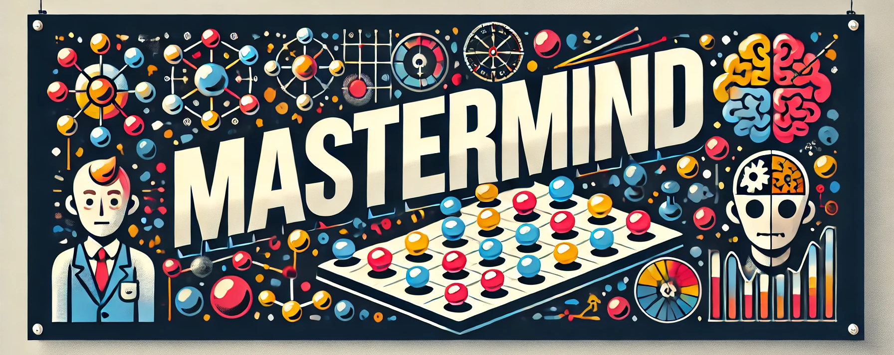

<!-- Improved compatibility of back to top link: See: https://github.com/othneildrew/Best-README-Template/pull/73 -->

<a name="readme-top"></a>

<!-- PROJECT SHIELDS -->
<!--
*** I'm using markdown "reference style" links for readability.
*** Reference links are enclosed in brackets [ ] instead of parentheses ( ).
*** See the bottom of this document for the declaration of the reference variables
*** for contributors-url, forks-url, etc. This is an optional, concise syntax you may use.
*** https://www.markdownguide.org/basic-syntax/#reference-style-links
-->

[![Contributors][contributors-shield]][contributors-url]
[![Forks][forks-shield]][forks-url]
[![Stargazers][stars-shield]][stars-url]
[![Issues][issues-shield]][issues-url]
[![MIT License][license-shield]][license-url]

<!-- PROJECT LOGO -->
<br />
<div align="center">
  <a href="https://github.com/totti00/PPS-22-mastermind">
    
  </a>

<h3 align="center">Mastermind</h3>

  <p align="center">
    A game based on logic, deduction, and pattern recognition, a clone of Mastermind designed for strategic codebreaking.
    <br />
    <br />
    <a href="https://totti00.github.io/PPS-22-mastermind/scaladoc/"><strong>Explore the docs 📖</strong></a>
  </p>
</div>

<!-- TABLE OF CONTENTS -->
<details>
  <summary>Table of Contents</summary>
  <ol>
    <li>
      <a href="#about-the-project">About The Project</a>
      <ul>
        <li><a href="#built-with">Built With</a></li>
      </ul>
    </li>
    <li>
      <a href="#getting-started">Getting Started</a>
    </li>
    <li><a href="#contributing">Contributing</a></li>
    <li><a href="#license">License</a></li>
    <li><a href="#acknowledgements">Acknowledgements</a></li>
  </ol>
</details>

<!-- ABOUT THE PROJECT -->

## About The Project
The goal of the project is to create a clone of the board game "Mastermind," a game of logic and deduction for two players.

In this game, the system assumes the role of the encoder by generating a secret combination of colored tokens. The player, 
acting as the decoder, must attempt to deduce the correct combination through a series of guesses. After each attempt, the 
system provides feedback using specialized indicators, specifying the number of correctly placed colors as well as the 
number of colors that are present but incorrectly positioned.

<!-- BUILT WITH -->

### Built With
- Scala 3
- SBT
- ScalaTest
- ScalaFX

<!-- GETTING STARTED -->

## Getting Started
The latest `.jar` file can be downloaded from the [releases section](https://github.com/Totti00/PPS-22-mastermind/releases).
To execute the game, run the following command:
```shell
$ java -jar `path-to-downloaded.jar`
```
Otherwise, you can clone the repository and run the game with the following command:
```shell
$ sbt compile
$ sbt run
```

<!-- CONTRIBUTING -->

## Contributing

Contributions are what make the open source community such an amazing place to learn, inspire, and create. Any contributions you make are **greatly appreciated**.

If you have a suggestion that would make this better, please fork the repo and create a pull request. You can also simply open an issue with the tag "enhancement".
Don't forget to give the project a star! Thanks again!

1. Fork the Project
2. Create your Feature Branch (`git checkout -b feature/AmazingFeature`)
3. Commit your Changes (`git commit -m 'Add some AmazingFeature'`)
4. Push to the Branch (`git push origin feature/AmazingFeature`)
5. Open a Pull Request

<!-- LICENSE -->

## License

Distributed under the MIT License. See [LICENSE](https://github.com/Totti00/PPS-22-mastermind/blob/main/LICENSE) for more information.

## Acknowledgements

- [Giacomo Totaro](https://www.linkedin.com/in/giacomo-totaro-8152801b3/)
- [Ramzi Gallala]()

<p align="right">(<a href="#readme-top">back to top</a>)</p>

<!-- MARKDOWN LINKS & IMAGES -->
<!-- https://www.markdownguide.org/basic-syntax/#reference-style-links -->

[contributors-shield]: https://img.shields.io/github/contributors/totti00/PPS-22-mastermind.svg?style=for-the-badge
[contributors-url]: https://github.com/totti00/PPS-22-mastermind/graphs/contributors
[forks-shield]: https://img.shields.io/github/forks/totti00/PPS-22-mastermind.svg?style=for-the-badge
[forks-url]: https://github.com/totti00/PPS-22-mastermind/network/members
[stars-shield]: https://img.shields.io/github/stars/totti00/PPS-22-mastermind.svg?style=for-the-badge
[stars-url]: https://github.com/totti00/PPS-22-mastermind/stargazers
[issues-shield]: https://img.shields.io/github/issues/totti00/PPS-22-mastermind.svg?style=for-the-badge
[issues-url]: https://github.com/zucchero-sintattico/totti00/issues
[license-shield]: https://img.shields.io/github/license/totti00/PPS-22-mastermind.svg?style=for-the-badge
[license-url]: https://github.com/totti00/PPS-22-mastermind/blob/master/LICENSE.txt