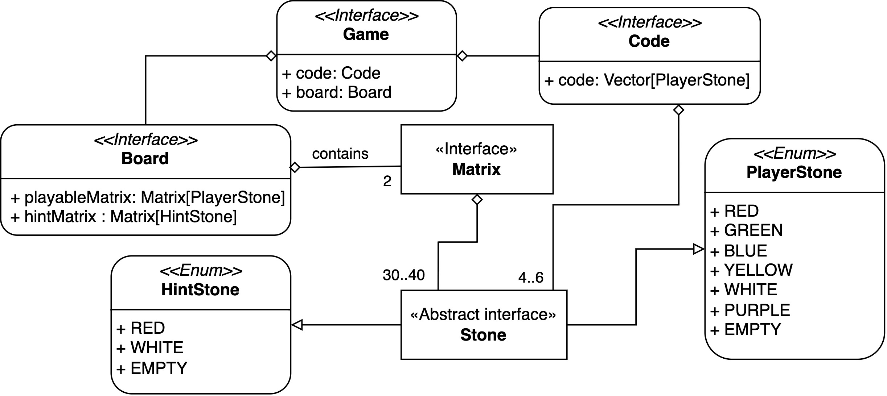

# Requisiti

## Business
- Creazione di un sistema che consenta di giocare al gioco Mastermind seguendo le regole di gioco originali.
- Il gioco deve essere implementato in modo da permettere a un singolo giocatore di sfidare il sistema, cercando
di indovinare un codice segreto generato dal sistema stesso entro un numero limitato di tentativi.

## Modello di dominio
Per la realizzazione del dominio, ci siamo basati sulle regole ufficiali del gioco da tavolo **Mastermind**.
Di seguito sarà riportata una descrizione più dettagliata del nostro dominio applicativo.

## Funzionali

### Utente
- L'utente deve poter interagire con l'applicazione tramite un'interfaccia grafica.
- L'utente deve poter visualizzare il menù principale all'avvio dell'applicazione, con le opzioni per iniziare una
  nuova partita e visualizzare le regole.
- L'utente deve poter iniziare una nuova partita scegliendo tra diverse modalità di gioco.
- L'utente deve poter visualizzare il campo di gioco una volta iniziata la partita.
- L'utente deve poter inserire una sequenza di colori per provare a indovinare il codice segreto.
- L'utente deve poter ricevere un feedback per ogni tentativo effettuato.
- L'utente deve poter vedere il tempo trascorso durante la partita.
- L'utente deve poter visualizzare il numero di tentativi rimanenti.
- L'utente deve poter riavviare la partita in qualsiasi momento.
- L'utente deve poter cambiare la modalità di gioco in ogni fase della partita.
- L'utente deve poter visualizzare le regole del gioco in qualsiasi momento della partita.
- L'utente deve poter vedere una lista dei tentativi effettuati, con i rispettivi feedback associati.
- L'utente deve poter essere informato del termine della partita, che si verifica quando il giocatore indovina il codice
  segreto (vittoria) o quando esaurisce i tentativi a disposizione (sconfitta).

### Sistema
- Il sistema deve poter gestire la navigazione tra il menu principale, la schermata di gioco e la sezione delle regole.
- Il sistema deve poter avviare una nuova partita, preparando l'area di gioco sulla base della modalità scelta.
- Il sistema deve essere in grado di generare un codice segreto casuale sulla base della modalità scelta.
- Il sistema deve fornire al giocatore la possibilità di scelta della modalità di gioco.
- Il sistema deve permettere al giocatore la possibilità di fare i tentativi.
- Il sistema deve validare l' input del giocatore al fine di restituire un feedback.
- Il sistema deve comunicare all'utente un feedback, indicando quanti colori sono corretti e nella posizione giusta e quanti sono corretti ma nella posizione sbagliata.
- Il sistema deve visualizzare il campo di gioco.
- Il sistema deve visualizzare i tentativi effettuati dal giocatore.
- Il sistema deve visualizzare il numero di tentativi rimanenti.
- Il sistema deve visualizzare il tempo trascorso dall'avvio della partita.
- Il sistema deve poter consentire il riavvio della partita in qualsiasi momento, ripristinando lo stato iniziale del gioco.
- Il sistema deve poter determinare l'esito della partita verificando se il giocatore ha indovinato il codice segreto o ha esaurito i tentativi.
- Il sistema deve poter visualizzare le regole di gioco in qualsiasi momento.
- Il sistema deve consentire il cambio della modalità di gioco in qualsiasi momento.

## Non funzionali
- Usabilità: l'interfaccia grafica deve essere user-friendly. 
- Affidabilità: il gioco non deve presentare crash o blocchi inaspettati ed essere stabile.
- Portabilità: il gioco deve essere cross-platform, cioè eseguibile su SO Windows, Linux e MacOS.
- Documentazione: realizzare una documentazione chiara e completa per facilitare la comprensione del codice e la risoluzione dei problemi.
- Manutenibilità: il codice deve essere strutturato in modo da agevolare future modifiche e aggiornamenti.
- Performance: il sistema deve essere reattivo alle azioni del giocatore e in grado di sostenere il carico di lavoro necessario per lo svolgimento una partita.

## Implementazione
Utilizzo di:
- Scala 3.3.5
- ScalaTest 3.3.x
- JDK 19+
- ScalaFX 22.0.0-R33
- tuProlog 4.x

## Requisiti Opzionali:
- Gestione delle partite: fornire un sistema per avviare, mettere in pausa, salvare e riprendere partite in corso.
- Ranking e statistiche di gioco: sviluppare una pagina per visualizzare classifiche e statistiche utili a monitorare le prestazioni dei giocatori nel corso del tempo.
- Modalità multiplayer online: sviluppare una funzione che permetta ai giocatori in luoghi diversi di sfidarsi in partite online.
- Area di gioco configurabile: sviluppare un'interfaccia che permetta ai giocatori di personalizzare il codice segreto e la grandezza del campo di gioco.