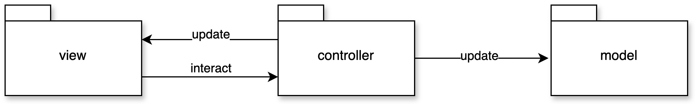

# Design Architetturale

In seguito all'analisi dei requisiti dell'applicativo si è scelto di utilizzare un'architettura basata sul pattern `MVC` (Model - 
View - Controller), questo permette di incapsulare i compiti dei vari componenti in modo da rendere il programma altamente modulare 
e facile da modificare in futuro.

L'architettura scelta vede quindi la presenza di tre componenti principali:

- **Model**: al cui interno sono state poste tutte le entità che si occupano di gestire la logica di gioco. Cattura il comportamento dell'applicazione, indipendentemente dall'interfaccia utente, e fornisce i metodi per poter accedere ai dati;
- **Controller**: ricopre il ruolo di ponte fra model e view, occupandosi dello scambio di informazioni fra questi due. Riceve i comandi dall'utente attraverso la View e reagisce modificando lo stato dei componenti View e Model;
- **View**: in cui è possibile trovare tutte le interfacce grafiche per l'interazione con il sistema. Visualizza i dati contenuti nel Model e si occupa dell'interazione con gli utenti, notificando il Controller.
  
In sintesi, si è deciso di utilizzare questo pattern in quanto favorisce il riuso del codice, facilita la manutenzione del software e ne agevola la scalabilità.