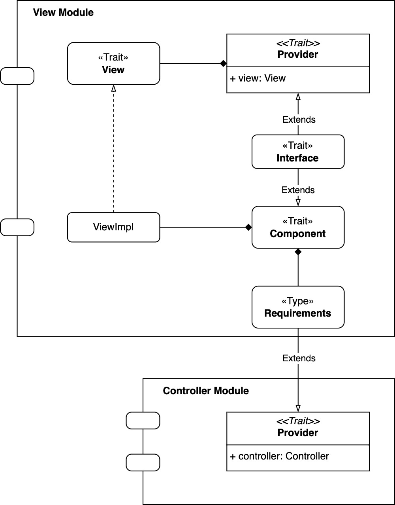
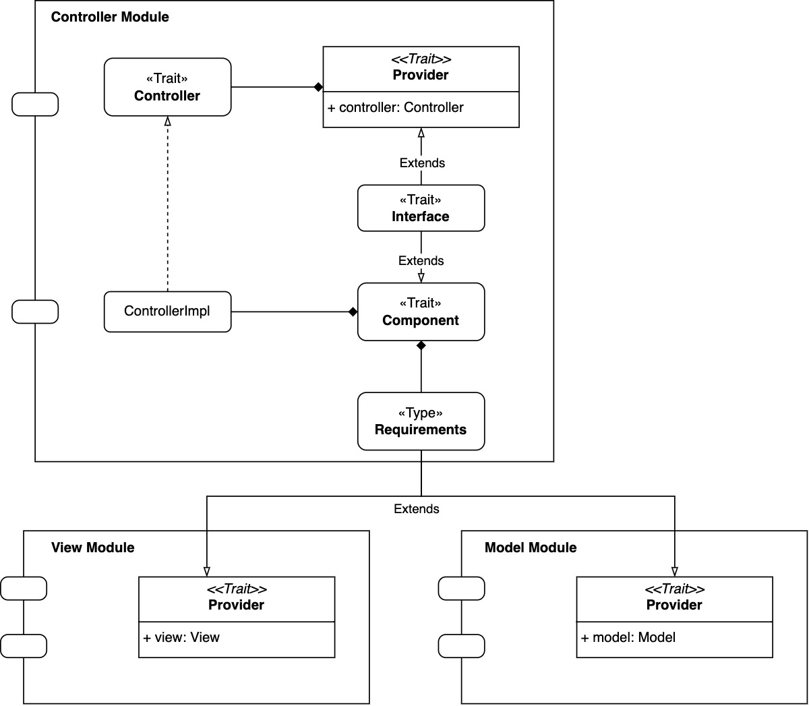

# Design di dettaglio

In questo capitolo verrà descritta nel dettaglio l'architettura del sistema, analizzandone i principali componenti e le 
rispettive caratteristiche.

## Component programming & cake Pattern
Come illustrato nella sezione precedente, si è scelto di adottare il pattern architetturale MVC. Per facilitare questa implementazione,
è stato impiegato il Cake Pattern, che consente di gestire le dipendenze tra i vari componenti in modo chiaro e strutturato, sfruttando
caratteristiche avanzate della programmazione funzionale come self-type, mix-in e type-members.
In particolare, ogni componente da implementare segue cinque principi fondamentali:
1. Un trait che definisce l'interfaccia del componente;
2. Un trait `Provider`, responsabile dell'esposizione del componente attraverso una variabile singleton-like;
3. Un type-member `Requirements`, che dichiara esplicitamente le dipendenze necessarie affinché il componente possa operare 
correttamente (queste verranno mixed-in dai provider degli altri componenti);
4. Un trait `Component`, che fornisce l'implementazione concreta del componente;
5. Un trait `Interface`, che combina e organizza gli elementi del modulo, rendendolo pronto per l'uso. 

Di seguito è riportato un esempio di modulo Controller realizzato secondo questo modello:
```scala
object ControllerModule:
  trait Controller:
    def goToPage(path: PagesEnum, mode: Option[String] = None): Unit
    def startGame(difficulty: String): Unit
  
  trait Provider:
    val controller: Controller

  type Requirements = ViewModule.Provider with ModelModule.Provider

  trait Component:
    context: Requirements =>
    class ControllerImpl extends Controller:
      override def goToPage(path: PagesEnum, mode: Option[String] = None): Unit = context.view.loadView(path, mode)
      override def startGame(difficulty: String): Unit = context.model.startNewGame(difficulty)

  trait Interface extends Provider with Component:
    self: Requirements =>
```

## Model


### Game

-- INSERIRE IMMAGINE GAME --

Questa interfaccia modella il concetto di *gioco*, rappresenta l'entità centrale del modello di dominio per il gioco. Tale *trait* 
espone i seguenti metodi fondamentali:
- **board**: ha lo scopo di mantenere traccia dei tentati e i feedback relativi all’utente
- **code**: rappresenta il codice segreto che il giocatore deve indovinare.
- **remainingTurns** e **currentTurn**: Consentono, rispettivamente, di determinare il numero di turni rimanenti e di accedere al turno corrente; il metodo currentTurn_() incrementa il turno in corso.     -- DA RIVEDERE IL SETTER -- 
- **state**: Questo metodo gestisce il GameState, un'entità che descrive lo stato della partita.

#### GameState

-- INSERIRE IMMAGINE GAMESTATE --

`GameState` è un *sealed trait* che rappresenta i tre possibili stati:
- **InGame**: indica che la partita è in corso
- **PlayerWin**: segnala la vittoria
- **PlayerLose**: indica la sconfitta 

Questi stati vengono utilizzati per controllare il flusso della partita e per aggiornare la logica di gioco (ad esempio, 
interrompendo il gioco in caso di vittoria o sconfitta).

#### GameMode

-- INSERIRE IMMAGINE GAMEMODE --

Per quanto riguarda la configurazione delle partite, il `ModelModule` si avvale del *trait* `GameMode` per gestire le diverse 
modalità di gioco. In particolare, il metodo *startNewGame* mappa la stringa corrispondente al livello di difficoltà scelto 
dall'utente a una specifica modalità, che può essere una tra le seguenti:
- **EasyMode**
- **MediumMode**
- **HardMode**
- **ExtremeMode**

Queste classi definiscono, rispettivamente, le dimensioni della board, la lunghezza del codice segreto e il numero di colori utilizzabili;
consentendo di istanziare un nuovo gioco con parametri che variano in base alla modalità scelta.

### Code

-- INSERIRE IMMAGINE CODE --

Il *trait* `Code` rappresenta il codice segreto che il giocatore deve indovinare. Quando viene creato un nuovo codice segreto, viene sfruttata
la funzione *random*, che genera una sequenza casuale di colori tra quelli disponibili. Questa funzione non solo determina il 
codice segreto, ma definisce anche la tavolozza di colori selezionabili nel corso della partita.
L'implementazione concreta di Code, denominata `CodeImpl`, fornisce il metodo *compareTo*, responsabile del confronto tra il codice 
segreto e il tentativo dell'utente. Questo metodo restituisce un insieme di suggerimenti basato sulle corrispondenze tra il codice 
e l' input del giocatore. Il calcolo del feedback avviene attraverso due metodi ausiliari:
- **compareToEqual**: determina le corrispondenze esatte, identificando le pedine che coincidono sia per colore 
che per posizione con il codice segreto.
- **compareToPresent**: rileva le pedine presenti nel codice segreto ma collocate in una posizione errata.

Per fornire un feedback strutturato e coerente con le regole del gioco, compareTo utilizza il metodo *joinVectors*, che combina i 
risultati prodotti da compareToEqual e compareToPresent. Il metodo garantisce che il numero totale di suggerimenti generati sia 
sempre pari alla lunghezza del codice segreto, completando l'output con pedine vuote qualora necessario.

#### Interazione con Prolog

-- INSERIRE IMMAGINE PROLOG --

L'integrazione con un motore logico *Prolog* viene sfruttata sia per la generazione casuale del codice segreto sia per il confronto 
con l'input del giocatore. In particolare, viene utilizzato:
- nella funzione *random*, attraverso predicati, per determinare una combinazione casuale di colori validi
- nei metodi *compareToEqual* e *compareToPresent*, invocando predicati per analizzare la relazione tra 
il codice segreto e l'input del giocatore, restituendo un insieme di suggerimenti rappresentati da pedine di tipo `HintStone`.

#### Stone

-- INSERIRE IMMAGINE STONE--

Il *trait* `Stone` rappresenta un'astrazione comune per le pedine utilizzate nel gioco. Da esso derivano due entità principali:
- **PlayerStone**: rappresenta le pedine selezionabili dal giocatore per comporre un tentativo. Questo tipo di pedine include sei colori 
principali e alcuni stati speciali (Playable, Empty, Win)
- **HintStone**: rappresenta i suggerimenti forniti dal sistema in risposta ai tentativi effettuati dal giocatore. Esistono tre tipi di 
HintStone:
  - *HintRed*: indica una corrispondenza esatta tra codice segreto e input.
  - *HintWhite*: segnala che il colore è presente nel codice segreto ma si trova in una posizione errata.
  - *HintEmpty*: indica che il colore non è presente nel codice segreto.

### Board (inserire Matrix)

-- INSERIRE IMMAGINE BOARD --

Il *trait* `Board`definisce l'interfaccia della griglia di gioco, suddivisa in due matrici. La prima rappresenta 
i tentativi effettuati dall’utente (PlayableStone) mentre la seconda i feedback connessi a ogni tentativo (HintStone).
Queste possono essere gestite mediante metodi dedicati per ottenere dimensioni e accedere agli elementi in posizioni specifiche.
Tra le operazioni principali offerte dall'interfaccia, quelle fondamentali sono:
- **placeGuessAndHints** che permette di aggiornare entrambe le matrici, tramite il metodo *replaceRow*, con la combinazione scelta dall'utente e il relativo feedback
- **initializeCurrentTurn** che inizializza la riga corrispondente al turno corrente, predisponendo le celle per l’inserimento delle scelte del giocatore
- **winBoard** che modifica l'intera matrice di gioco assegnando a tutte le celle lo stato di vittoria, garantendo una 
rappresentazione visiva del successo ottenuto.

## View


Parlare di come abbiamo fatto le view

## Controller


Parlare anche di SubmittGuess e startNewTurn

## Pattern utilizzati

### Strategy
Nel nostro progetto, il pattern Strategy è stato implementato utilizzando un'interfaccia (trait) GameMode e più classi concrete (EasyMode, MediumMode, HardMode, ExtremeMode). Questo approccio consente di modellare le diverse modalità di gioco in modo incapsulato e scalabile, mantenendo un'architettura chiara e facilmente estendibile.

Un esempio di utilizzo della strategia nel nostro codice è il seguente:

```scala
override def startNewGame(difficulty: String): Unit =
  currentMode = giveMeEither {
    difficulty.toLowerCase match
      case "easy"    => EasyMode()
      case "medium"  => MediumMode()
      case "hard"    => HardMode()
      case "extreme" => ExtremeMode()
  } match
    case Right(result) => result
    case Left(_)       => MediumMode()
```

In questo frammento, il modo di gioco viene selezionato dinamicamente in base alla difficoltà scelta dal giocatore, istanziando l'oggetto corrispondente.
A differenza di un approccio basato su funzioni higher-order, in cui la strategia viene passata come parametro a una funzione, il nostro approccio a classi consente di incapsulare lo stato e il comportamento di ogni modalità di gioco in modo autonomo, rendendo più agevole la manutenzione e l'estensione del codice.

In contesti in cui le strategie sono puramente funzionali e prive di stato, l'uso di funzioni higher-order può risultare più conciso. Tuttavia, nel nostro caso, il pattern Strategy basato su classi è risultato più adeguato, garantendo una maggiore chiarezza e separazione delle responsabilità.

## Organizzazione del codice
Il codice è stato struttura in package come descritto nel seguente diagramma