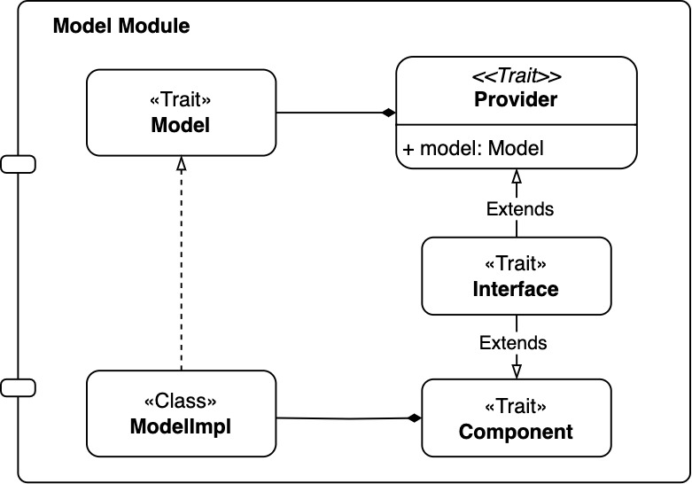
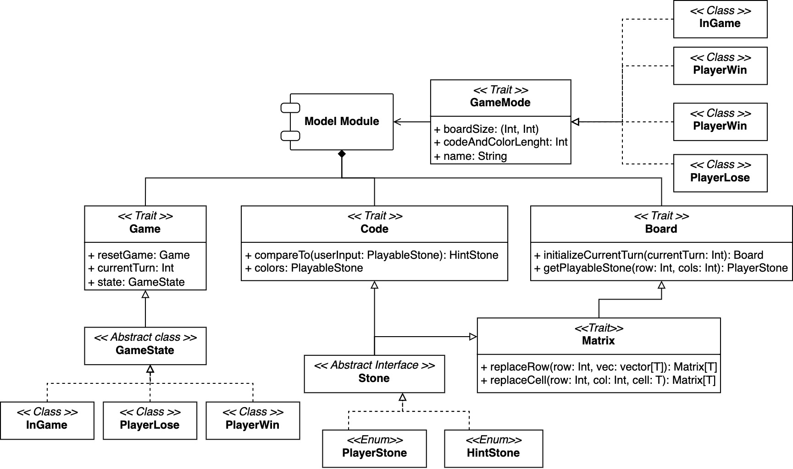

# Design di dettaglio

In questo capitolo verrà descritta nel dettaglio l'architettura del sistema, analizzandone i principali componenti e le 
rispettive caratteristiche.

## Component programming & cake Pattern
Come illustrato nella sezione precedente, si è scelto di adottare il pattern architetturale MVC. Per facilitare questa implementazione,
è stato impiegato il Cake Pattern, che consente di gestire le dipendenze tra i vari componenti in modo chiaro e strutturato, sfruttando
caratteristiche avanzate della programmazione funzionale come self-type, mix-in e type-members.
In particolare, ogni componente da implementare segue cinque principi fondamentali:
1. Un trait che definisce l'interfaccia del componente;
2. Un trait `Provider`, responsabile dell'esposizione del componente attraverso una variabile singleton-like;
3. Un type-member `Requirements`, che dichiara esplicitamente le dipendenze necessarie affinché il componente possa operare 
correttamente (queste verranno mixed-in dai provider degli altri componenti);
4. Un trait `Component`, che fornisce l'implementazione concreta del componente;
5. Un trait `Interface`, che combina e organizza gli elementi del modulo, rendendolo pronto per l'uso. 

Di seguito è riportato un esempio di modulo Controller realizzato secondo questo modello:
```scala
object ControllerModule:
  trait Controller:
    def goToPage(path: PagesEnum, mode: Option[String] = None): Unit
    def startGame(difficulty: String): Unit
  
  trait Provider:
    val controller: Controller

  type Requirements = ViewModule.Provider with ModelModule.Provider

  trait Component:
    context: Requirements =>
    class ControllerImpl extends Controller:
      override def goToPage(path: PagesEnum, mode: Option[String] = None): Unit = context.view.loadView(path, mode)
      override def startGame(difficulty: String): Unit = context.model.startNewGame(difficulty)

  trait Interface extends Provider with Component:
    self: Requirements =>
```

## Model




### Game

-- INSERIRE IMMAGINE GAME --

Questa interfaccia modella il concetto di *gioco*, rappresenta l'entità centrale del modello di dominio per il gioco. Tale *trait* 
espone i seguenti metodi fondamentali:
- **board**: ha lo scopo di mantenere traccia dei tentati e i feedback relativi all’utente
- **code**: rappresenta il codice segreto che il giocatore deve indovinare.
- **remainingTurns** e **currentTurn**: Consentono, rispettivamente, di determinare il numero di turni rimanenti e di accedere al turno corrente; il metodo currentTurn_() incrementa il turno in corso.     -- DA RIVEDERE IL SETTER -- 
- **state**: Questo metodo gestisce il GameState, un'entità che descrive lo stato della partita.

#### GameState

-- INSERIRE IMMAGINE GAMESTATE --

`GameState` è un *sealed trait* che rappresenta i tre possibili stati:
- **InGame**: indica che la partita è in corso
- **PlayerWin**: segnala la vittoria
- **PlayerLose**: indica la sconfitta 

Questi stati vengono utilizzati per controllare il flusso della partita e per aggiornare la logica di gioco (ad esempio, 
interrompendo il gioco in caso di vittoria o sconfitta).

#### GameMode

-- INSERIRE IMMAGINE GAMEMODE --

Per quanto riguarda la configurazione delle partite, il `ModelModule` si avvale del *trait* `GameMode` per gestire le diverse 
modalità di gioco. In particolare, il metodo *startNewGame* mappa la stringa corrispondente al livello di difficoltà scelto 
dall'utente a una specifica modalità, che può essere una tra le seguenti:
- **EasyMode**
- **MediumMode**
- **HardMode**
- **ExtremeMode**

Queste classi definiscono, rispettivamente, le dimensioni della board, la lunghezza del codice segreto e il numero di colori utilizzabili;
consentendo di istanziare un nuovo gioco con parametri che variano in base alla modalità scelta.

### Code (inserire Stone)

-- IMMAGINE DI CODE --

Il codice rappresenta la sequenza di colori segreta che il decodificatore deve indovinare.
la funzione compareTo della classe Code andrà a calcolare il feedback e tornerà la sequenza di colori.
Per fare cio utilizza due metodi che rappresentano le regole ed un terzo per unire queste ultime due.
In particolare le regole sono state definite utilizzando toprolog:
 - spiegazione prima regola
 - spiegazione seconda 

unione delle prime due regole (joinRules)

#### Stone

-- IMMAGINE DI STONE --
Il metodo random si occupa di generare il codice attraverso due passi, entrambi utilizzando toProlog:
- si occupa di creare prima la lista dei colori da utilizzare in base alla modalità.
- per ottenere il codice segreto viene richiamata la regola +nome regola+ di toprolog per
ritornare un codice segreto utilizzando i colori scelti dal passo precedente


La classe Code è un trait che rappresenta il codice segreto da indovinare. Nel momento in cui viene creato il codice segreto, viene sfruttato il metodo random per generare una sequenza casuale di colori.
Questo metodo genera prima una combinazione casuale di colori, che saranno utilizzati per creare il codice segreto.
Successivamente si utilizza una regola prolog per la generazione del codice segreto.

Code definisce un metodi principali:
- compareTo(userInput: PlayableStones): esegue il confronto tra il codice segreto e il tentativo dell'utente, restituendo un feedback. 
Nell ospecifico, si avvale di due metodi ausialiari che sono:
  - compareToEqual()
  - compareToPresent


1) cos'è Code
2) random
3) compareTo


La classe Code è un trait che rappresenta il codice segreto da indovinare. Nel momento in cui viene creato il codice segreto, 
viene sfruttato il metodo random per generare una sequenza casuale di colori.

Questo metodo genera prima una combinazione casuale di colori, che saranno utilizzati per creare il codice segreto. 
Successivamente si utilizza una regola prolog per la generazione del codice segreto.


L'implementazione concreta di Code, definita come CodeImpl, definisce alcuni metodi principali, tra cui:
- compareTo andrà a calcolare il feedback e tornerà la sequenza di colori.
Per fare cio utilizza due metodi che rappresentano le regole ed un terzo per unire queste ultime due.


Code Impl che è una implementazione di code definisce alcuni metodi principali, tra cui:
- compareTo eé un metodo del trait code che 
- compare toequal e il comparetopresent


Interazione con Prolog

Il modulo fa uso di un motore Prolog per determinare casualmente il codice segreto e per confrontare l'input del giocatore con il
codice da indovinare. In particolare, il motore viene utilizzato nei seguenti contesti:
- Per la generazione casuale del codice e della tavolozza di colori utilizzabili, sfruttando i predicati permutation e codeGenerator;
- Per il calcolo dei suggerimenti, invocando i predicati compareToEqual e compareToPresent e trasformando l'output in un vettore di
  HintStone.

Stone
Il trait Stone rappresenta un'astrazione comune per le pedine utilizzate nel gioco. Da esso derivano due tipologie di entità:
- PlayerStone, che rappresenta le pedine selezionabili dal giocatore per comporre un tentativo;
- HintStone, che rappresenta i suggerimenti forniti dal sistema in risposta ai tentativi effettuati.


Essa definisce un metodi principali:
- compareTo(userInput: PlayableStones): esegue il confronto tra il codice segreto e il tentativo dell'utente, restituendo un insieme 
di suggerimenti (HintStones).


L'oggetto Code fornisce due metodi apply, uno per creare un codice casuale dato un valore di dimensione e l'altro per creare un 
codice predefinito per scopi di test. La creazione di un codice casuale avviene sfruttando il metodo PlayerStone.random(size), che 
genera un insieme casuale di pedine.
L'implementazione concreta di Code, definita come CodeImpl, utilizza un motore Prolog (engine) per il confronto tra il codice segreto 
e l'input dell'utente. Il metodo compareTo richiama due metodi ausiliari:
- compareToEqual(userInput), che individua le corrispondenze esatte tra codice e input;
- compareToPresent(userInput), che rileva le pedine presenti ma in posizione errata.
Entrambi questi metodi sfruttano getHintStonesByRule, che invoca un predicato Prolog per ottenere i suggerimenti corrispondenti alle 
regole di Mastermind. Il metodo joinVectors unisce i risultati prodotti dai metodi di confronto, completando il vettore di 
suggerimenti con pedine vuote (HintEmpty) in modo che la sua dimensione sia pari a quella del codice segreto.


Classe Stone

Il trait Stone rappresenta un'astrazione comune per le pedine utilizzate nel gioco. Da esso derivano due tipologie di entità:
- PlayerStone, che rappresenta le pedine selezionabili dal giocatore per comporre un tentativo;
- HintStone, che rappresenta i suggerimenti forniti dal sistema in risposta ai tentativi effettuati.

L'enum PlayerStone definisce le pedine giocabili, tra cui sei colori (Red, Green, Blue, Yellow, White, Purple), oltre a stati 
speciali (Playable, Empty, Win). Il metodo toString fornisce una rappresentazione testuale della pedina.
L'oggetto PlayerStone include un motore Prolog per la generazione casuale di codici e colori. Il metodo random genera una 
combinazione casuale di pedine attraverso randomHelper, che utilizza il predicato permutation per selezionare colori e codeGenerator 
per determinare il codice segreto.
L'enum HintStone definisce le pedine che costituiscono il feedback del sistema: HintRed indica una corrispondenza esatta, HintWhite 
una corrispondenza parziale e HintEmpty nessuna corrispondenza. Anche in questo caso, è presente un metodo toString per restituire 
una rappresentazione testuale della pedina di suggerimento.


Interazione con Prolog

Il modulo fa uso di un motore Prolog per determinare casualmente il codice segreto e per confrontare l'input del giocatore con il 
codice da indovinare. In particolare, il motore viene utilizzato nei seguenti contesti:
- Per la generazione casuale del codice e della tavolozza di colori utilizzabili, sfruttando i predicati permutation e codeGenerator;
- Per il calcolo dei suggerimenti, invocando i predicati compareToEqual e compareToPresent e trasformando l'output in un vettore di 
HintStone.


### Board (inserire Matrix)

## View
Immagine della struttura cake view
Parlare di come abbiamo fatto le view

## Controller
Immagine della struttura cake controller e basta

Parlare anche di SubmittGuess e startNewTurn

## Pattern utilizzati

### Strategy
Nel nostro progetto, il pattern Strategy è stato implementato utilizzando un'interfaccia (trait) GameMode e più classi concrete (EasyMode, MediumMode, HardMode, ExtremeMode). Questo approccio consente di modellare le diverse modalità di gioco in modo incapsulato e scalabile, mantenendo un'architettura chiara e facilmente estendibile.

Un esempio di utilizzo della strategia nel nostro codice è il seguente:

```scala
override def startNewGame(difficulty: String): Unit =
  currentMode = giveMeEither {
    difficulty.toLowerCase match
      case "easy"    => EasyMode()
      case "medium"  => MediumMode()
      case "hard"    => HardMode()
      case "extreme" => ExtremeMode()
  } match
    case Right(result) => result
    case Left(_)       => MediumMode()
```

In questo frammento, il modo di gioco viene selezionato dinamicamente in base alla difficoltà scelta dal giocatore, istanziando l'oggetto corrispondente.
A differenza di un approccio basato su funzioni higher-order, in cui la strategia viene passata come parametro a una funzione, il nostro approccio a classi consente di incapsulare lo stato e il comportamento di ogni modalità di gioco in modo autonomo, rendendo più agevole la manutenzione e l'estensione del codice.

In contesti in cui le strategie sono puramente funzionali e prive di stato, l'uso di funzioni higher-order può risultare più conciso. Tuttavia, nel nostro caso, il pattern Strategy basato su classi è risultato più adeguato, garantendo una maggiore chiarezza e separazione delle responsabilità.

## Organizzazione del codice
Il codice è stato struttura in package come descritto nel seguente diagramma