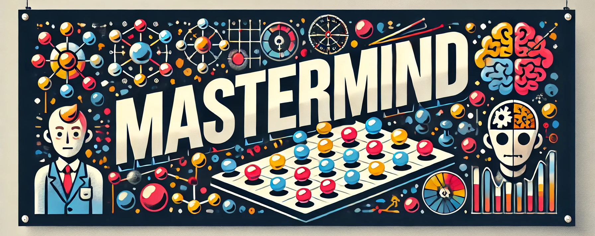

# Introduzione

L'obiettivo del progetto è la realizzazione di un clone del gioco Mastermind, un classico gioco da tavolo di logica.

Nel gioco, un giocatore assume il ruolo del codificatore, il quale sceglie una combinazione segreta di pedine colorate, 
mentre l'altro giocatore, il decodificatore, deve cercare di indovinarla attraverso una serie di tentativi.
Dopo ogni tentativo, il codificatore fornisce un feedback utilizzando appositi indicatori, i quali segnalano quanti colori 
sono corretti e nella giusta posizione e quanti sono presenti ma in una posizione errata.

## Obiettivo del gioco
Il fine ultimo del gioco è individuare la combinazione segreta nel minor numero possibile di tentativi, sfruttando la 
logica deduttiva e interpretando correttamente i suggerimenti forniti dal codificatore.

## Contributors

- [Giacomo Totaro](https://github.com/Totti00)
- [Ramzi Gallala](https://github.com/ramzigallala)